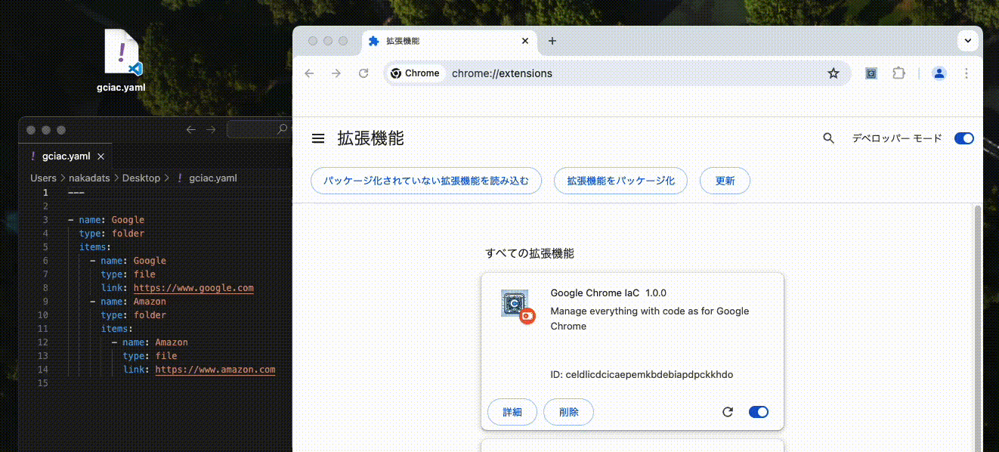

## google-chrome-iac

You can manage Google Chrome as code (like IaC).

## Getting Started

1. Build the code.

```shell
$ docker compose up -d

$ docker compose exec -it node npm install

$ docker compose exec -it node npm run build
```

2. Upload to Google Chrome Extensions

Visit `chrome://extensions/` on Google Chrome Web Browser. Then, press the `Load unpacked` button.

## How to use it

Check the below video. Please feel free to ask if you still don't understand after watching it.



## Sample code

- [Sample code](./gciac.yaml)
